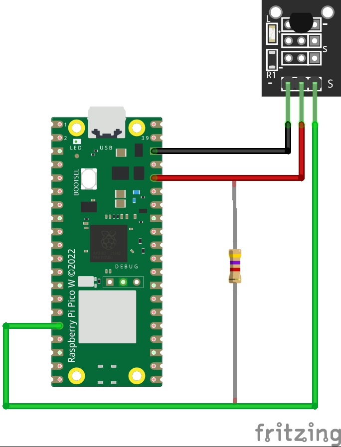

# KY-001: Sensor de Temperatura (DS18B20)

Este diretório contém um projeto de exemplo para o Raspberry Pi Pico W que demonstra como ler a temperatura ambiente utilizando o módulo sensor KY-001, que é baseado no popular sensor **DS18B20**.

A abordagem utilizada aqui é de **baixo nível**, manipulando diretamente o pino GPIO para implementar o protocolo de comunicação digital **1-Wire**, sem a necessidade de bibliotecas de terceiros. Isso serve como um excelente estudo de caso sobre como protocolos baseados em temporização funcionam.

Este projeto faz parte de uma coleção maior para explorar 37 periféricos com o Raspberry Pi Pico W. Para mais informações, consulte o [README principal do repositório](../README.md).

## ✨ Funcionalidades

- **Implementação de baixo nível:** Controle total sobre o protocolo 1-Wire.
- **Sem dependências externas:** Utiliza apenas as bibliotecas padrão do Pico C/C++ SDK.
- **Verificação de Integridade:** Inclui uma função para cálculo de **CRC8** (Verificação de Redundância Cíclica) para garantir que os dados lidos do sensor não estão corrompidos.
- **Código Modularizado:** A lógica do sensor está separada em `ds18b20.c` e `ds18b20.h`, facilitando a reutilização em outros projetos.

## 🛠️ Componentes Necessários

- 1x Raspberry Pi Pico W
- 1x Módulo Sensor de Temperatura KY-001 (DS18B20)
- 1x Resistor de **4.7kΩ** (pull-up)
- Protoboard e Jumpers

## 🔌 Esquema de Ligação

O protocolo 1-Wire requer um resistor de pull-up no pino de dados para funcionar corretamente. Conecte o resistor de 4.7kΩ entre o pino de Sinal (S) e o pino de 3.3V.

| Pino do Módulo KY-001  | Conexão                     | Pino do Raspberry Pi Pico W |
| :--------------------- | :-------------------------- | :-------------------------- |
| **- (GND)**            | Terra                       | **GND**                     |
| **VCC (Pino do meio)** | Alimentação 3.3V            | **3V3 (OUT)**               |
| **S (Sinal)**          | Pino de Dados (com pull-up) | **GPIO 16**                 |

## 💻 Estrutura do Código

O projeto está dividido em três arquivos principais para promover a modularidade:

- **`main.c`**: Contém a lógica principal da aplicação. Ele inicializa o sistema, chama as funções do sensor em um loop e imprime os resultados na serial.
- **`ds18b20.h`**: O arquivo de cabeçalho (header). Define a interface pública do driver, como as constantes (`ONEWIRE_PIN`) e os protótipos das funções que o `main.c` pode chamar.
- **`ds18b20.c`**: O arquivo de implementação. Contém todo o código de baixo nível que lida com o protocolo 1-Wire e a comunicação com o sensor DS18B20.

## ⚙️ Como Funciona

O protocolo 1-Wire se baseia em uma temporização precisa para diferenciar bits '0' e '1'. A comunicação com o sensor DS18B20 segue estes passos:

1.  **Reset e Presença**: O Pico (mestre) envia um **pulso de reset** (puxa a linha para baixo por ~480µs). O sensor (escravo) responde com um **pulso de presença** para indicar que está na linha.
2.  **Comando de Conversão**: O Pico envia o comando `0xCC` (Skip ROM, para se comunicar com todos os sensores na linha) seguido do comando `0x44` (Convert T), que instrui o sensor a iniciar uma medição de temperatura.
3.  **Espera**: A medição pode levar até 750ms. O código aguarda um tempo suficiente para a conversão ser concluída.
4.  **Comando de Leitura**: O Pico envia um novo pulso de reset, o comando `0xCC` e, em seguida, o comando `0xBE` (Read Scratchpad) para solicitar os dados da memória do sensor.
5.  **Leitura dos Dados**: O Pico lê 9 bytes do sensor. Os dois primeiros contêm o valor da temperatura, e o último é um CRC para verificação de erros.
6.  **Cálculo e Exibição**: O código verifica o CRC, converte o valor bruto de 12 bits para graus Celsius e o imprime no monitor serial.

---

## Datasheet do DS18B20

Para mais detalhes técnicos sobre o sensor DS18B20, consulte o [datasheet oficial](https://datasheets.maximintegrated.com/en/ds/DS18B20.pdf).

---
